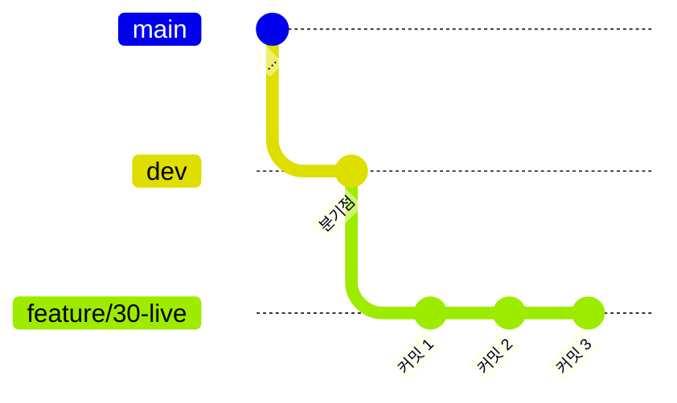
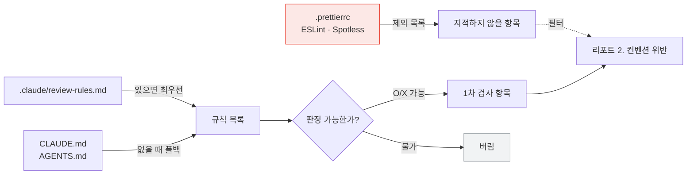
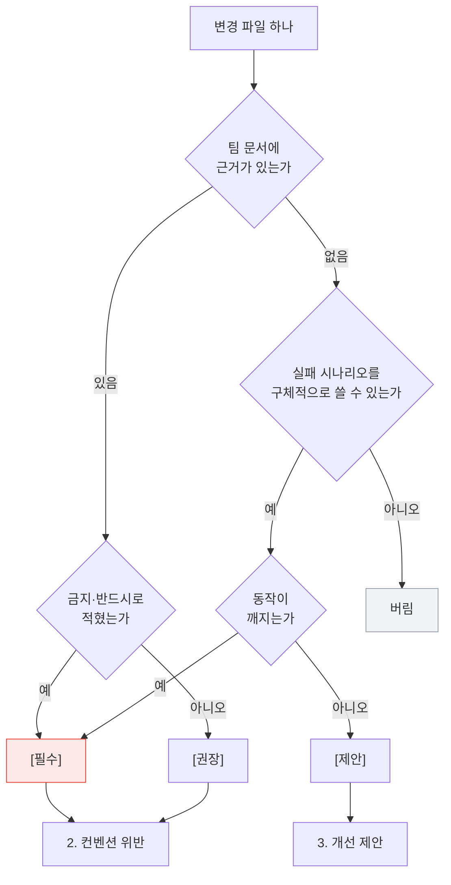

# 시스템 설계도 — branch-review

## 전체 구조

```mermaid
flowchart TB
    U["사용자<br/>/branch-review:review"] --> CMD["commands/review.md<br/>슬래시 명령"]
    CMD --> SKILL["skills/review/SKILL.md<br/>리뷰 절차"]

    SKILL --> SH["scripts/collect.sh<br/>사실 수집 · 읽기 전용"]
    SH --> GIT[("git<br/>로컬 레포")]
    GIT --> OUT["수집 결과 평문<br/>TARGET · SOURCES · COMMITS<br/>FILES · UNTRACKED · DIFF"]

    OUT --> SKILL
    SKILL --> READ["기준 문서 읽기"]
    READ --> R1["`.claude/review-rules.md`"]
    READ --> R2["`CLAUDE.md` · `AGENTS.md`"]
    READ --> R3["`.prettierrc` · ESLint · Spotless"]

    SKILL --> REF["references/<br/>criteria.md<br/>checklist-*.md"]

    SKILL --> JUDGE["판정"]
    JUDGE --> REPORT["리포트 4부 구조"]

    style SH fill:#e8f0fe,stroke:#4285f4
    style JUDGE fill:#fef7e0,stroke:#f9ab00
    style REPORT fill:#e6f4ea,stroke:#34a853
```

역할이 셋으로 갈린다.

| 층 | 담당 | 하지 않는 것 |
|---|---|---|
| `collect.sh` | 사실 수집 | 판단, 파일 쓰기 |
| `SKILL.md` | 절차와 출력 형식 | 규칙 자체를 정하는 일 |
| 기준 문서 | 규칙 | 도구에 종속되는 일 |

규칙을 도구 안에 두지 않았다. 설계의 중심이 여기 있다. 규칙을 플러그인에 넣으면 팀마다 플러그인을 고쳐야 하고 규칙이 바뀔 때마다 도구를 다시 배포해야 한다. 규칙은 팀 레포에 두고 도구는 읽기만 한다.

## 수집 범위



`origin/dev`와 `HEAD`의 **분기점(merge-base)부터 워킹트리까지**를 본다. `git diff <merge-base>`가 그 범위다.

`dev`에 새 커밋이 쌓여도 그 변경은 리뷰에 섞이지 않는다. 남이 만든 코드를 내 브랜치 리뷰에서 지적하는 일이 없다.

커밋한 것과 아직 커밋하지 않은 것을 함께 본다. PR 올리기 직전에 쓰는 도구라 워킹트리의 마지막 수정까지 대상이어야 한다.

## 기준 파일 해석



세 번째 입력이 특이하다. 포매터 설정은 검사 항목이 아니라 **제외 목록**으로 쓰인다. 세미콜론·따옴표·들여쓰기·import 정렬은 저장할 때 자동으로 고쳐지므로 사람에게 시킬 일이 아니다.

## 판정 흐름



오른쪽 아래 `버림` 갈래가 이 흐름도의 핵심이다. 문서 인용도 못 하고 실패 시나리오도 못 대면 그 지적은 나가지 않는다. 그런 지적 하나가 진짜 지적 열 개의 신뢰를 깎는다.

`Q4`에 예외가 하나 있다. 컨벤션에 없더라도 **명백한 버그는 `[필수]`로 올린다.** 문서에 안 적혔다고 깨진 코드를 통과시킬 수는 없다.

## 파일 구조

```
branch-review/
├── .claude-plugin/
│   ├── plugin.json          플러그인 메타
│   └── marketplace.json     설치 소스 정의
├── commands/
│   └── review.md            /branch-review:review
├── skills/review/
│   ├── SKILL.md             절차 · 출력 형식 · 규칙
│   ├── scripts/
│   │   └── collect.sh       수집 (읽기 전용)
│   ├── references/
│   │   ├── criteria.md      기준 정의 · 심각도
│   │   ├── checklist-common.md
│   │   ├── checklist-frontend.md
│   │   └── checklist-backend.md
│   └── templates/
│       └── review-rules.md  팀이 복사해 채우는 규칙 템플릿
└── docs/
    ├── planning.md
    ├── user-scenarios.md
    ├── architecture.md
    └── sample-review.md     실제 적용 결과
```

`references`를 SKILL.md에서 분리한 이유는 컨텍스트 비용이다. SKILL.md는 매번 읽힌다. 체크리스트는 해당 스택의 파일이 변경됐을 때만 읽힌다. Java만 바뀐 브랜치에서 React 체크리스트를 읽을 이유가 없다.

## 스크립트가 짧은 이유

`collect.sh`는 판단을 전혀 하지 않는다. 이유가 둘이다.

**첫째, 리뷰에는 diff 밖의 정보가 필요하다.** "이 유틸이 이미 있는가"를 알려면 레포를 검색해야 하고 "이 변경이 무엇을 깨뜨리는가"를 알려면 호출부를 찾아야 한다. 스크립트가 미리 판단해 버리면 그 판단을 뒤집을 방법이 없다.

**둘째, 규칙이 자연어다.** CLAUDE.md의 "컨트롤러에 비즈니스 로직을 넣지 않는다"를 정규식으로 옮길 수는 없다. 규칙을 코드로 옮기는 순간 팀은 문서 대신 도구를 고쳐야 한다.

그래서 스크립트는 사실만 모으고 모델이 문서를 읽어 판정한다. 스크립트에 남은 판단은 하나뿐이다 — 비교 기준 브랜치 자동 탐지.

## 안전장치

| 장치 | 막는 것 |
|---|---|
| 읽기 전용 | 리뷰가 코드를 건드리는 일 |
| diff 1500줄 상한 + 생략 고지 | 잘린 자리를 추측으로 메우는 일 |
| lock·빌드 산출물 기본 제외 | 사람이 안 쓴 파일을 리뷰하는 일 |
| 통합 브랜치 작업 경고 | 위반을 조용히 넘기는 일 |
| 기준 문서 부재 시 중단 | 근거 없는 리뷰 |

두 번째가 특히 중요하다. 잘린 diff로 리뷰하면 모델은 없는 결함을 지어낸다. 상한에 걸리면 생략된 파일명을 남기고 그 파일은 직접 열어 읽거나 못 봤다고 밝히게 했다.
